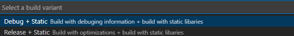

### CMake Variants

### cmake-variants.json

* 위치 :`./vscode/cmake-variants.json`
* 항목 키
    - buildTypes: 빌드 유형(디버그/릴리즈)을 정의
    - linkage: 정적/동적 링크 여부 정의

#### BuildTypes 설정

```json
{
    "buildTypes": {
      "default": "Debug",
      "description": "Build Type Selection",
      "choices": {
        "Debug": {
          "short": "Debug",
          "long": "Build with debuging information",
          "buildType": "Debug"
        },
        "Release": {
          "short": "Release",
          "long": "Build with optimizations",
          "buildType": "Release"
        }
      }
    }
}
```

* `short` : 표시되는 짧은 이름 (예: "Debug")
* `long` : 빌드 타입에 대한 설명
* `buildType` : `CMake` 의 `CMAKE_BUILD_TYPE` 값

#### linkage 설정

```json
"linkage" : {
      "default": "static",
      "description" : "static libs",
      "choices":
      {
        "static" :{
          "short" : "Static",
          "long" : "build with static libaries",
          "linkage" : "static"
        }
      }

    }
```

* linkage 는 빌드 시 정적 또는 동적 라이브러리 사용 여부를 제어합니다.

#### 선택 팔레트




[Back](../../README.md)