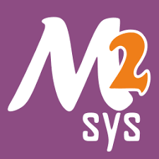

# Setting Up MSYS2 MinGW with VSCode



## [ Windows ]

#### 1. Install MSYS2
* Downloading Official installer [msys2-x86_64-installer.exe](https://github.com/msys2/msys2-installer/releases/download/2025-06-22/msys2-x86_64-20250622.exe)
* Select the latest release version of `LLVM`.
* Download the Windows Installer (e.g., `LLVM-XX.X.X-win64.exe`).
* During installation:
   - Make sure check the option to add `LLVM` to the system `PATH`
   - Use the default installation path `C:\Program Files\LLVM\`.

#### 2. Verify Installation
* Open the Command Prompt (`cmd`).
* Run the following command to check if `clang++` is accessible:
   ```bash
   clang++ --version
   ```
* If version info appears, `LLVM` is installed correctly